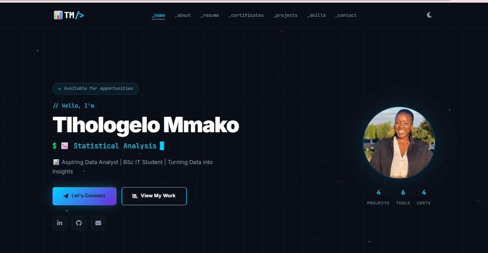
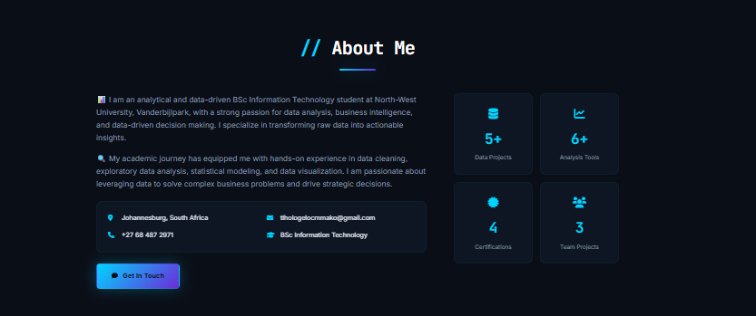
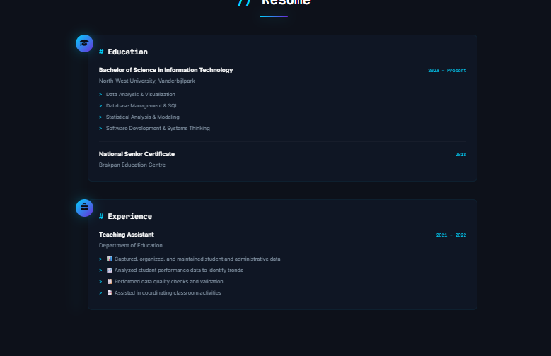
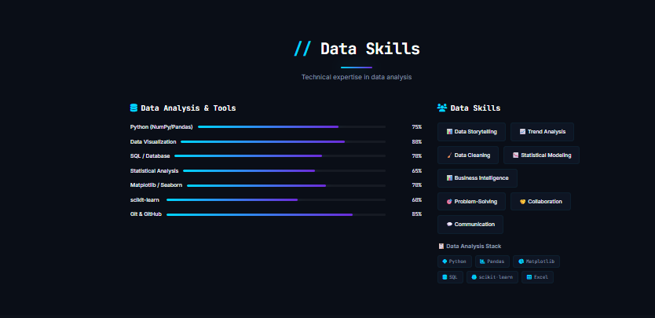
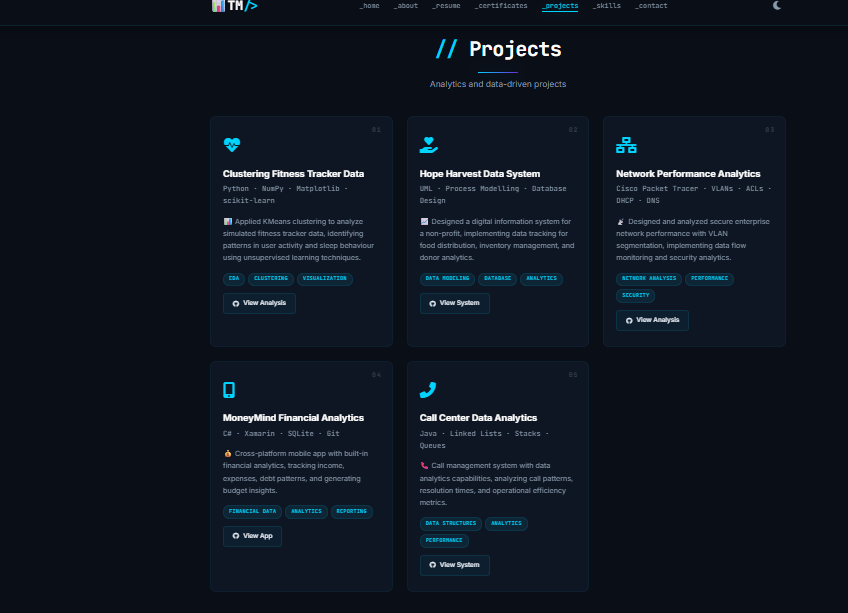
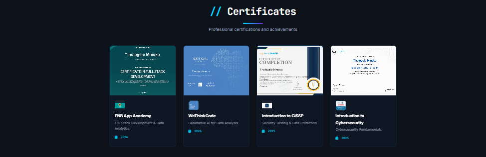
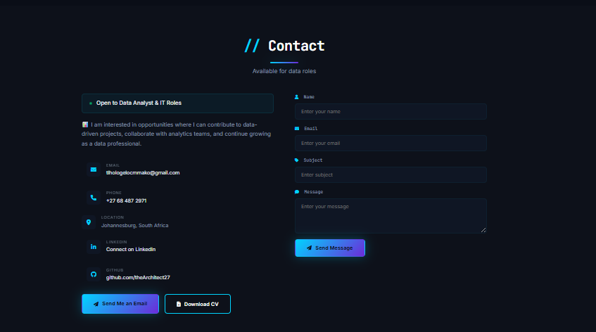

# Virtual CV Portfolio

## Overview

This repository contains the source code for my Virtual CV and portfolio website, developed as part of the Project Development module.

The website serves as an interactive portfolio, showcasing my academic background, technical skills, projects, certifications, and contact information. It also provides direct links to my GitHub profile and LinkedIn profile.

## Live Website

🌐 https://tlhologelo-m-virtual-cv.netlify.app/

## Features

- Responsive design
- About Me section
- Resume/CV
- Technical skills
- Projects with GitHub repository links
- Certifications
- Contact information
- Downloadable CV

## Technologies Used

- HTML5
- CSS3
- JavaScript
- Netlify (Deployment)

## Screenshots
## Screenshots

### Profile

### About Me

### Experience and Education

### Skills

### Projects

### Certifications

### Contact

## Setup Instructions

1. Clone or download this repository.
2. Open the project folder.
3. Open `index.html` in your preferred web browser.

Alternatively, visit the live website:
https://tlhologelo-m-virtual-cv.netlify.app/

## Author

**Tlhologelo Mmako**

- LinkedIn: https://www.linkedin.com/in/tlhologelo-mmako-64a485200/

